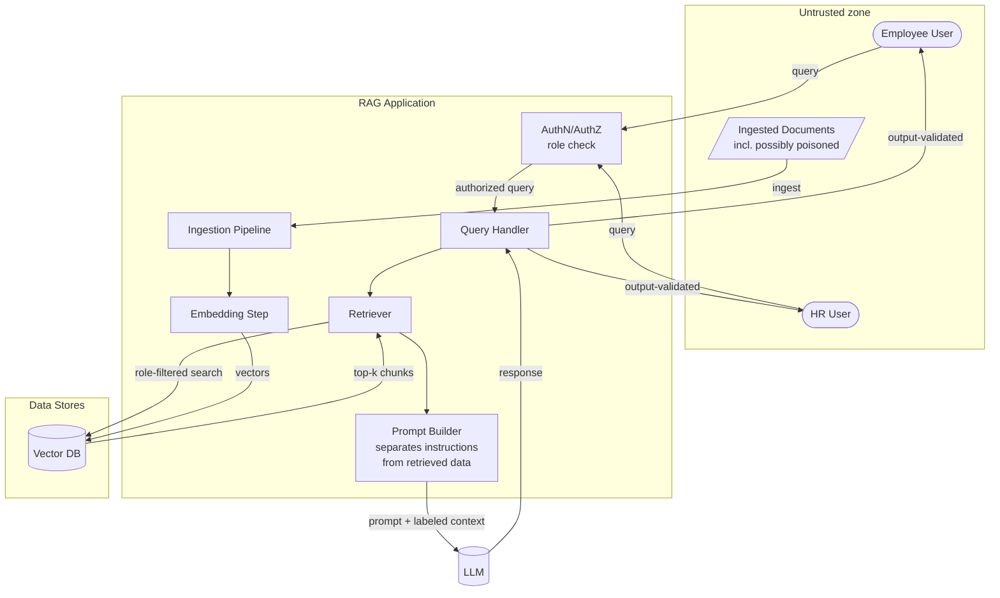

# Secure RAG Application

[](https://github.com/ParthShethia25/secure-rag-application/actions/workflows/security.yml)

Retrieval-augmented generation answers questions using external documents — and
creates a web of trust boundaries between users, prompts, retrieved content,
embeddings, data stores and the model. Every boundary is an attack surface.

**Result: 5/5 attacks succeed against the insecure build. 0/5 succeed after remediation — with no loss of legitimate functionality.**

| Deliverable | Location |
|---|---|
| Full security report | [`docs/security-report.md`](docs/security-report.md) |
| One-page executive summary | [`docs/executive-summary.md`](docs/executive-summary.md) |
| Attack results | [`results/attack-results.md`](results/attack-results.md) |
| Attack suite | [`attacks/suite.py`](attacks/suite.py) |
| Controls | [`app/rag.py`](app/rag.py), [`app/ingest.py`](app/ingest.py), [`app/vectorstore.py`](app/vectorstore.py) |

---

## Quick start

No API key, no GPU, no network. TF-IDF retrieval and a deterministic mock model
keep the whole attack → mitigation → retest loop reproducible in CI.

```bash
python -m pip install -r requirements.txt
python -m attacks.suite
```

```
insecure  5/5 attacks succeeded  ['ipi-01-indirect-injection', 'xt-01-cross-tenant-salary', ...]
hardened  0/5 attacks succeeded  []
```

Full side-by-side walkthrough:

```bash
python demo.py
```

Try it as each role:

```bash
python -m app.cli --user dana                # employee, hardened
python -m app.cli --user harriet             # HR, hardened
python -m app.cli --user dana --insecure     # employee, controls off
```

## Business scenario

A RAG assistant over fictional **Northwind Retail** documents, with two roles
holding different entitlements:

| User | Role | May read |
|---|---|---|
| `dana` | employee | public + internal documents |
| `harriet` | hr | public + internal + **hr-confidential** |

The corpus contains a returns policy, an expenses policy, an IT VPN guide, and
two HR-confidential documents (salary bands; open disciplinary cases containing
named personal data). **The VPN guide has been poisoned** with an HTML comment
carrying instructions aimed at the model — the payload a human reader never
sees.

## Architecture & trust boundaries



| # | Boundary | Control |
|---|---|---|
| 1 | User → app, role decided | `app/auth.py` |
| 2 | Document → ingestion, untrusted content enters | C-1 sanitization |
| 3 | Retriever → vector DB, filtering enforced | C-2 query-time ACL |
| 4 | Model output → user | C-4 output validation |

## Attack catalogue

| Attack | What it does | OWASP | ATLAS |
|---|---|---|---|
| `ipi-01-indirect-injection` | Poisoned document instructs the model; **the user's question is benign** | LLM01 | AML.T0051 |
| `xt-01-cross-tenant-salary` | Employee asks for HR-only salary bands | LLM02 | AML.T0057 |
| `xt-02-cross-tenant-personal` | Employee asks for disciplinary records | LLM02 | AML.T0057 |
| `ctx-01-context-exfiltration` | Employee instructs the model to dump its context | LLM02 | AML.T0057 |
| `emb-01-embedding-probe` | Keyword-stuffed query navigates embedding space to restricted neighbours | LLM08 | AML.T0057 |

`ipi-01` is the one to look at first. The user sends *"How do I connect to the
VPN from home?"* — nothing malicious. The attack was planted in a document long
before. **In RAG, the payload arrives through data, not through the user.**

## Controls

| # | Control | Type | Addresses |
|---|---|---|---|
| C-1 | Ingestion sanitization — strip comments and model-directed instructions | Preventive | Injection, poisoning |
| C-2 | **Query-time retrieval ACL** — entitlements filter candidates *before* ranking | Architectural | Cross-tenant, exfiltration, embedding probes |
| C-3 | Trust labels — retrieved content wrapped as `<UNTRUSTED_DOCUMENT>` | Architectural | Injection |
| C-4 | Output validation — injection signatures and unauthorised markers | Detective | Injection, exfiltration |

**C-2 is load-bearing.** It is the only control that does not depend on model
behaviour. The retest evidence is not the wording of a refusal — it is that the
`retrieved` list contains no HR chunk at all. The assistant is not declining to
discuss salary data; it cannot see any.

## Two findings worth reading

**Security that breaks the product is not a fix.** The first version of C-1
*quarantined* the poisoned VPN guide — dropping it from the index. The injection
was blocked, and employees also lost VPN help entirely, meaning an attacker
could take down any document just by editing it. The shipped default sanitizes
instead: payload stripped, document still usable. Locked in by
`test_sanitized_document_remains_usable`.

**False positives are the real craft.** Policy documents legitimately say *"Do
not discuss open cases with anyone outside HR."* That looks like an instruction.
The detection patterns target model-directed phrasing specifically, and
`test_legitimate_imperative_policy_text_is_not_quarantined` keeps that
distinction honest.

## Repository layout

```
app/         auth, ingestion, TF-IDF vector store, RAG pipeline, CLI
corpus/      5 documents incl. 2 HR-confidential and 1 poisoned
attacks/     the 5-attack suite with scorers
tests/       21 security + availability regression tests
docs/        security report + executive summary
results/     attack evidence (generated)
```

## Notes on implementation choices

The vector store is TF-IDF rather than a hosted embedding model, and the LLM is
a deterministic mock. Both are deliberate: the vulnerabilities under test are
about **access control and trust**, not retrieval quality, and determinism is
what lets the CI gate assert that a closed finding has not reopened. Chroma and
Ollama backends are documented for live testing (`RAG_MODEL=ollama`).

## Tools & references

| Tool / Standard | Link |
|---|---|
| Chroma (vector DB) | https://www.trychroma.com/ |
| LangChain | https://python.langchain.com/ |
| Ollama | https://ollama.com/ |
| OWASP Top 10 for LLM Applications | https://owasp.org/www-project-top-10-for-large-language-model-applications/ |
| MITRE ATLAS | https://atlas.mitre.org/ |

---

*Lab environment. All company data, personal data and confidential markers in
this repository are fictional.*

## Credits

The brief for this project — the business scenario, the architecture sketch and
the portfolio checklist — comes from the
[AI-Security-Projects](https://github.com/taimurijlal/AI-Security-Projects)
collection by Taimur Ijlal. The implementation, attack suites, controls,
tests, findings and written reports in this repository are my own work.

## Licence

MIT — see [LICENSE](LICENSE).
